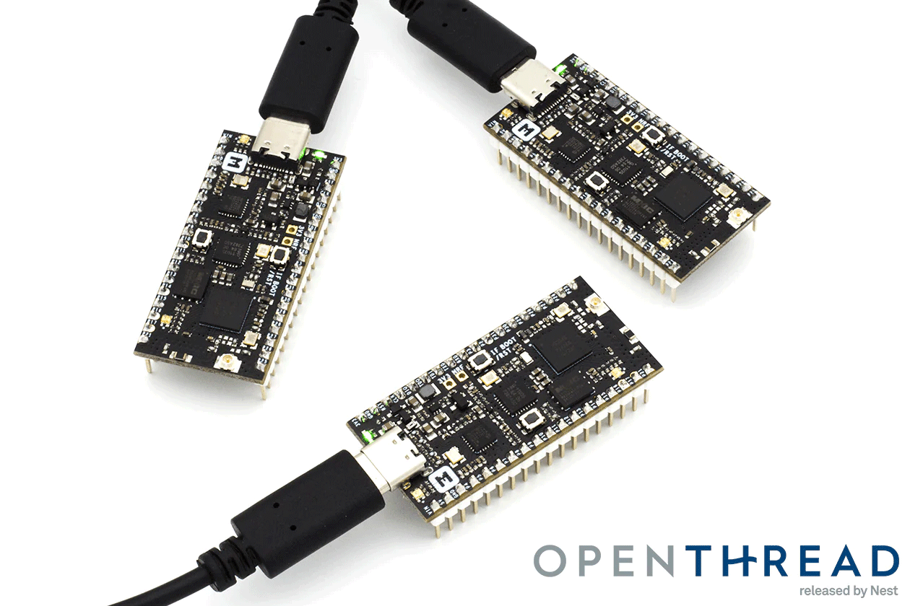
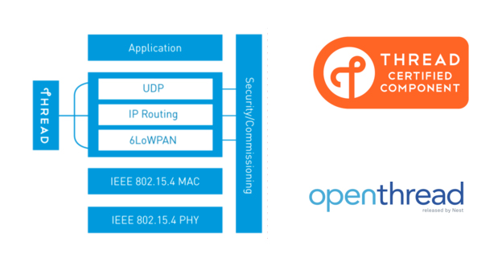
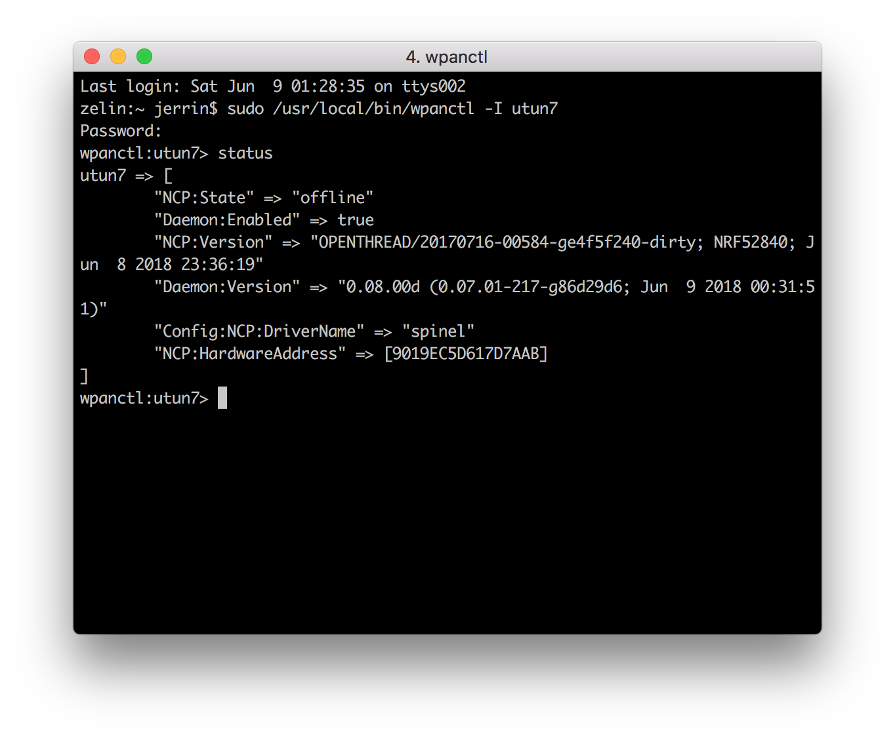
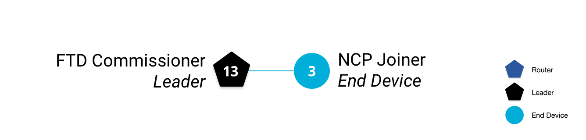

# Build a Thread network with nRF52840-MDK

## Introduction

[OpenThread](https://openthread.io/) is an open-source implementation of the [Thread®](http://threadgroup.org/) networking protocol. Nest has released OpenThread to make the networking technology used in Nest products more broadly available to developers, in order to accelerate the development of products for the connected home.

The [Thread specification](http://threadgroup.org/ThreadSpec) defines an IPv6-based reliable, secure and low-power wireless device-to-device communication protocol for home applications. OpenThread implements all Thread networking layers (IPv6, 6LoWPAN, IEEE 802.15.4 with MAC security, Mesh Link Establishment, Mesh Routing) and device roles, as well as Border Router support.



## What'll you need

- 3x [nRF52840-MDK](https://makerdiary.com/products/nrf52840-mdk-iot-development-kit) boards
- 3x USB-C cables
- A Linux/macOS machine with at least 3 USB ports

## Set up your development environment

The following section provides detailed information about the required software toolchains. Skip any step where a compatible tool already exists.

1. Download and install the [ARM GNU Toolchain](https://developer.arm.com/downloads/-/gnu-rm). The `6-2017-q2-update` version is recommended. Then ensure the path is added to your OS PATH environment variable.

    ``` bash
    # in ~/.bash_profile, add the following script
    export PATH="<path to install directory>/gcc-arm-none-eabi-6-2017-q2-update/bin:${PATH}"
    ```


2. Type the following in your terminal to verify if the path is set correctly:

    ``` bash
    arm-none-eabi-gcc --version
    ```

3. Install pyOCD:

    ``` bash
    pip install -U pyocd
    ```

4. Follow the [wpantund Installation Guide](https://github.com/openthread/wpantund/blob/master/INSTALL.md) to install [wpantund](https://github.com/openthread/wpantund).

5. Clone and install OpenThread:

    ``` bash
    git clone --recursive https://github.com/makerdiary/openthread.git
    cd openthread
    ./bootstrap
    ```

## Set up the NCP Joiner

### Build and flash

Build the OpenThread nRF52840 example with Joiner functionality. A device uses the Joiner role to be securely authenticated and commissioned onto a Thread network. Always clean the repo of previous builds first by running `make clean`.

``` bash
cd ~/openthread
make -f examples/Makefile-nrf52840 clean
make -f examples/Makefile-nrf52840 JOINER=1
```

Navigate to the directory with the OpenThread FTD NCP binary, and convert it to hex format:

``` bash
cd ~/openthread/output/nrf52840/bin
arm-none-eabi-objcopy -O ihex ot-ncp-ftd ot-ncp-ftd.hex
```

Connect nRF52840-MDK to your computer with a USB cable. Flash the OpenThread NCP FTD hex file onto the nRF52840-MDK and label the board __NCP__ so that later you don't confuse the board roles.

``` bash
pyocd flash -t nrf52840 ot-ncp-ftd.hex
```

### Configure wpantund

In the NCP design, use wpantund to communicate with and manage the Thread device.

In a terminal window, start `wpantund` on the serial port with the NCP, creating the interface `utun7` and enabling info logs:

``` bash
sudo /usr/local/sbin/wpantund -o Config:NCP:SocketPath /dev/cu.usbmodem14112  \
        -o Config:TUN:InterfaceName utun7 \
        -o Daemon:SyslogMask " -info"
```

Output similar to the following is generated upon success:

``` bash
Jun  9 01:29:49  wpantund[12257] <Notice>: Starting wpantund 0.08.00d (Jun  9 2018 00:31:51) . . .
Jun  9 01:29:49  wpantund[12257] <Notice>:  SOURCE_VERSION = 0.07.01-217-g86d29d6
Jun  9 01:29:49  wpantund[12257] <Notice>:  BUILD_VERSION = 0.07.01-217-g86d29d6
Jun  9 01:29:49  wpantund[12257] <Notice>: Configuration file "/etc/wpantund.conf" read.
Jun  9 01:29:49  wpantund[12257] <Notice>: Ready. Using DBUS bus ":1.2"
Jun  9 01:29:49  wpantund[12257] <Notice>: Running as root without dropping privileges!
Jun  9 01:29:49  wpantund[12257] <Notice>: State change: "uninitialized" -> "offline"
Jun  9 01:29:49  wpantund[12257] <Notice>: NCP is running "OPENTHREAD/20170716-00584-ge4f5f240-dirty; NRF52840; Jun  8 2018 23:36:19"
Jun  9 01:29:49  wpantund[12257] <Notice>: Driver is running "0.08.00d (0.07.01-217-g86d29d6; Jun  9 2018 00:31:51)"
1:29:49  wpantund[12257] <Notice>: Network is not joinable
Jun  9 01:29:49  wpantund[12257] <Notice>: Resetting interface(s). . .
Jun  9 01:29:49  wpantund[12257] <Notice>: Finished initializing NCP
```

Leave this terminal window open so that logs from wpantund can be viewed.

A user-defined interface is required to communicate with the NCP using `wpanctl`. Open a new terminal window and using `wpanctl`, connect to the interface you just set up:

``` bash
sudo /usr/local/bin/wpanctl -I utun7
wpanctl:utun7>
wpanctl:utun7> status
```



## Set up the FTDs

The other two Thread nodes used in this section are Full Thread Devices (FTDs) on the standard System-on-Chip (SoC) design. They do not use `wpantund`, and the user manually manages them with the OpenThread CLI.

One device functions as the Commissioner, to securely authenticate and commission devices onto that network. The other device functions as a Joiner that the Commissioner can authenticate to the Thread network.

### Build and flash

Build the OpenThread FTD example for the nRF52840-MDK, with the Commissioner and Joiner roles enabled:

``` bash
cd ~/openthread
make -f examples/Makefile-nrf52840 clean
make -f examples/Makefile-nrf52840 COMMISSIONER=1 JOINER=1
```

Navigate to the directory with the OpenThread Full Thread Device (FTD) CLI binary, and convert it to hex format:

``` bash
cd ~/openthread/output/nrf52840/bin
arm-none-eabi-objcopy -O ihex ot-cli-ftd ot-cli-ftd.hex
```

Connect another nRF52840-MDK to your computer with a USB cable. Flash the OpenThread CLI FTD hex file and label the board __Commissioner__:

``` bash
pyocd flash -t nrf52840 ot-cli-ftd.hex
```

### Verify build

Verify a successful build by accessing the OpenThread CLI using a terminal application. The nRF52840-MDK boards use a baud rate of `115200`.

``` bash
# For example, using screen
screen /dev/cu.usbmodem142112 115200
```

In the terminal window, press <kbd>Enter</kbd> on the keyboard a few times to bring up the OpenThread CLI `>` prompt. Check for IPv6 addresses:

``` bash
> ipaddr
fd11:2233:4455:0:99ea:1fe9:acd6:d384
fe80:0:0:0:2003:a240:810f:1598
Done
```

### Set up the FTD Joiner

Repeat the above process to flash the third nRF52840-MDK board, using the existing `ot-cli-ftd.hex` build. Then label the board __Joiner__. Check for IPv6 addresses in the terminal window:

``` bash
> ipaddr
fe80:0:0:0:d079:7d86:6413:4f4e
fd11:2233:4455:0:e839:eb52:f7ec:74e3
Done
```

## Create the Thread network

Now that you have all your terminal windows and screens configured, let's create our Thread network. On the __Commissioner__, configure the network and bring up Thread:

``` bash
## FTD Commissioner ##
----------------------

> networkname makerdiary
Done
> extpanid 1122334455667788
Done
> panid 0x1122
Done
> masterkey 11223344556677881122334455667788
Done
> ifconfig up
Done
> thread start
Done
```

After a moment, check the device state. It should be the __Leader__. Also get the `RLOC16` for future reference.

``` bash
## FTD Commissioner ##
----------------------

> state
leader
Done
> rloc16
3400
Done
```

Check the device's IPv6 addresses:

``` bash
## FTD Commissioner ##
----------------------

> ipaddr
fd11:2233:4455:0:0:ff:fe00:fc00        # Leader Anycast Locator (ALOC)
fd11:2233:4455:0:0:ff:fe00:3400        # Routing Locator (RLOC)
fd11:2233:4455:0:99ea:1fe9:acd6:d384   # Mesh-Local EID (ML-EID)
fe80:0:0:0:2003:a240:810f:1598         # Link-Local Address (LLA)
Done
```

The `makerdiary` network is now visible when scanned from other Thread devices.

From `wpanctl` on the __NCP Joiner__:

``` bash
## NCP Joiner ##
----------------

wpanctl:utun7> scan
   | Joinable | NetworkName        | PAN ID | Ch | XPanID           | HWAddr           | RSSI
---+----------+--------------------+--------+----+------------------+------------------+------
 1 |       NO | "makerdiary"       | 0x1122 | 11 | 1122334455667788 | 2203A240810F1598 |  -59

```

From the OpenThread CLI on the __FTD Joiner__:

``` bash
## FTD Joiner ##
----------------

> scan
| J | Network Name     | Extended PAN     | PAN  | MAC Address      | Ch | dBm | LQI |
+---+------------------+------------------+------+------------------+----+-----+-----+
> | 0 | makerdiary       | 1122334455667788 | 1122 | 2203a240810f1598 | 11 | -32 | 244 |
Done
```

If the `makerdiary` network doesn't appear in the list, try scanning again.

You may note that in both scans, the network seems to be not joinable (_Joinable_ column on the __NCP Joiner__, _J_ column on the __FTD Joiner__). This only means that Thread Commissioning is not active on the network. It can still be joined out-of-band, by entering the network master key in the joiner device manually.

## Add the NCP Joiner

Let's add the __NCP Joiner__ to the Thread network we just created, using an out-of-band process. Scan for networks on the __NCP Joiner__:

``` bash
## NCP Joiner ##
----------------

wpanctl:utun7> scan
   | Joinable | NetworkName        | PAN ID | Ch | XPanID           | HWAddr           | RSSI
---+----------+--------------------+--------+----+------------------+------------------+------
 1 |       NO | "makerdiary"       | 0x1122 | 11 | 1122334455667788 | EE7A6D71FB28C60D |  -68
```

To join, set the network master key on the __NCP Joiner__ and join network `1` (the ID in the first column of the scan output):

``` bash
## NCP Joiner ##
----------------

wpanctl:utun7> setprop Network:Key 11223344556677881122334455667788
wpanctl:utun7> join 1
Joining "makerdiary" 1122334455667788 as node type "end-device"
Successfully Joined!
```

Check the status of the __NCP Joiner__ to verify. It might take a few seconds for all IPv6 addresses to appear in the output.

``` bash
## NCP Joiner ##
----------------

wpanctl:utun7> status
utun7 => [
    "NCP:State" => "associated"
    "Daemon:Enabled" => true
    "NCP:Version" => "OPENTHREAD/20170716-00650-g631557e8-dirty; NRF52840; Jun  9 2018 15:45:03"
    "Daemon:Version" => "0.08.00d (0.07.01-217-g86d29d6; Jun  9 2018 00:31:51)"
    "Config:NCP:DriverName" => "spinel"
    "NCP:HardwareAddress" => [9019EC5D617D7AAB]
    "NCP:Channel" => 11
    "Network:NodeType" => "end-device"
    "Network:Name" => "makerdiary"
    "Network:XPANID" => 0x1122334455667788
    "Network:PANID" => 0x1122
    "IPv6:LinkLocalAddress" => "fe80::60bd:ff84:2121:344d"
    "IPv6:MeshLocalAddress" => "fd11:2233:4455::f:b5e:169b:b875"
    "IPv6:MeshLocalPrefix" => "fd11:2233:4455::/64"
    "com.nestlabs.internal:Network:AllowingJoin" => false
]
```

Make note of the `IPv6:MeshLocalAddress`, you'll use it later.

Get the __NCP Joiner__'s `RLOC16`:

``` bash
## NCP Joiner ##
----------------

wpanctl:utun7> getprop Thread:RLOC16
Thread:RLOC16 = 0x3403
```

Back on the __FTD Commissioner__, check the router and child tables to confirm both devices are part of the same network. Use the `RLOC16` to identify the __NCP Joiner__.

``` bash
## FTD Commissioner ##
----------------------

> router table
| ID | RLOC16 | Next Hop | Path Cost | LQ In | LQ Out | Age | Extended MAC     |
+----+--------+----------+-----------+-------+--------+-----+------------------+
| 13 | 0x3400 |       63 |         0 |     0 |      0 |   0 | 2203a240810f1598 |

Done
> child table
| ID  | RLOC16 | Timeout    | Age        | LQ In | C_VN |R|S|D|N| Extended MAC     |
+-----+--------+------------+------------+-------+------+-+-+-+-+------------------+
|   3 | 0x3403 |        240 |         66 |     3 |   86 |1|1|1|1| 62bdff842121344d |

Done
```

Ping the mesh-local address of the NCP Joiner (the `IPv6:MeshLocalAddress` attribute from the __NCP Joiner__'s `status` output) to verify connectivity:

``` bash
## FTD Commissioner ##
----------------------

> ping fd11:2233:4455::f:b5e:169b:b875
> 8 bytes from fd11:2233:4455:0:f:b5e:169b:b875: icmp_seq=2 hlim=64 time=35ms
```



## Commission the FTD Joiner

Now let's add the third Thread device to the `makerdiary` network. This time we're going to use the more secure in-band commissioning process. On the __FTD Joiner__, scan for the network:

``` bash
## FTD Joiner ##
----------------

> scan
| J | Network Name     | Extended PAN     | PAN  | MAC Address      | Ch | dBm | LQI |
+---+------------------+------------------+------+------------------+----+-----+-----+
> | 0 | makerdiary       | 1122334455667788 | 1122 | 2203a240810f1598 | 11 | -32 | 244 |
Done
```

A `0` in the `J` column indicates that Thread Commissioning is not active on the device.

Let's be specific when commissioning on this next device, and only allow the __FTD Joiner__ to join. Still on the __FTD Joiner__, get the `eui64`, so the __FTD Commissioner__ can identify it:

``` bash
## FTD Joiner ##
----------------

> eui64
31ae3e8e7b87cfd6
Done
```

On the __FTD Commissioner__, start the commissioner and specify the eui64 of the device that can join, along with the Joiner Credential. The Joiner Credential is a device-specific passphrase.

``` bash
## FTD Commissioner ##
----------------------

> commissioner start
Done
> commissioner joiner add 31ae3e8e7b87cfd6 J01NME
Done
```

Switch to the __FTD Joiner__, and rescan:

``` bash
## FTD Joiner ##
----------------

> scan
| J | Network Name     | Extended PAN     | PAN  | MAC Address      | Ch | dBm | LQI |
+---+------------------+------------------+------+------------------+----+-----+-----+
> | 1 | makerdiary       | 1122334455667788 | 1122 | 2203a240810f1598 | 11 | -32 | 244 |
Done
```

As indicated by the `1` in the `J` column, Thread Commissioning is now active on the network. Start the joiner role with the Joiner Credential you just set up on the __FTD Commissioner__:

``` bash
## FTD Joiner ##
----------------

> ifconfig up
Done
> joiner start J01NME
Done
```

Within a minute or so, you get a confirmation of a successful authentication.

Bring up Thread so the __FTD Joiner__ joins the `makerdiary` network, and immediately check the state and `RLOC16`:

``` bash
## FTD Joiner ##
----------------

> thread start
Done
> state
child
Done
> rloc16
3404
Done
```

Check the device's IPv6 addresses. Notice that there is no ALOC. That's because this device is not the Leader, nor does it hold an Anycast-specific role that requires an ALOC.

``` bash
## FTD Joiner ##
----------------

> ipaddr
fd11:2233:4455:0:0:ff:fe00:3404
fe80:0:0:0:7827:55cf:47e4:5907
fd11:2233:4455:0:e839:eb52:f7ec:74e3
Done
```

Immediately switch to the __FTD Commissioner__ and check the router and child tables to confirm that three devices exist in the `makerdiary` network:

``` bash
## FTD Commissioner ##
----------------------

> router table
| ID | RLOC16 | Next Hop | Path Cost | LQ In | LQ Out | Age | Extended MAC     |
+----+--------+----------+-----------+-------+--------+-----+------------------+
| 13 | 0x3400 |       63 |         0 |     0 |      0 |   0 | 2203a240810f1598 |

Done
> child table
| ID  | RLOC16 | Timeout    | Age        | LQ In | C_VN |R|S|D|N| Extended MAC     |
+-----+--------+------------+------------+-------+------+-+-+-+-+------------------+
|   3 | 0x3403 |        240 |        231 |     3 |   86 |1|1|1|1| 62bdff842121344d |
|   4 | 0x3404 |        240 |         49 |     3 |   88 |1|1|1|1| 7a2755cf47e45907 |

Done
```

Based on the `RLOC16`, the __FTD Joiner__ has attached to the network as an End Device (child). Here is our updated topology:


## Send messages with UDP

One of the application services that OpenThread provides is User Datagram Protocol (UDP), a Transport Layer protocol. An application built on OpenThread could use the UDP API to pass messages between nodes in a Thread network, or to other devices in an external network (like the internet, if the Thread network features a Border Router).

UDP sockets are exposed through the OpenThread CLI. Let's use it to pass messages between the two FTDs.

Get the Mesh-Local EID address for the __FTD Joiner__. We're using this address because it's reachable from anywhere within the Thread network.

``` bash
## FTD Joiner ##
----------------

> ipaddr
fd11:2233:4455:0:0:ff:fe00:fc00        # Leader Anycast Locator (ALOC)
fd11:2233:4455:0:0:ff:fe00:f400        # Routing Locator (RLOC)
fe80:0:0:0:7827:55cf:47e4:5907         # Link-Local Address (LLA)
fd11:2233:4455:0:e839:eb52:f7ec:74e3   # Mesh-Local EID (ML-EID)
Done
```

Start UDP and bind it to a socket for any IPv6 address:

``` bash
## FTD Joiner ##
----------------

> udp open
Done
> udp bind :: 1212
```

Switch to the __FTD Commissioner__, start UDP, and connect to the socket you set up on the __FTD Joiner__, using its ML-EID:

``` bash
## FTD Commissioner ##
----------------------

> udp open
Done
> udp connect fd11:2233:4455:0:e839:eb52:f7ec:74e3 1212
Done
```

The UDP connection should be live between the two nodes. Send a message from the __FTD Commissioner__:

``` bash
## FTD Commissioner ##
----------------------

> udp send hello-openthread
Done
```
On the __FTD Joiner__, the UDP message has been received!

``` bash
## FTD Joiner ##
----------------

> 16 bytes from fd11:2233:4455:0:0:ff:fe00:3400 49153 hello-openthread
```

## Congratulations!

You've created a physical Thread network with nRF52840-MDK!

## Reference

- [Build a Thread network with nRF52840 boards and OpenThread](https://codelabs.developers.google.com/codelabs/openthread-hardware/#0) - covers all the steps in this post
- [openthread.io](https://openthread.io/)
- [github.com/openthread](https://github.com/openthread/openthread/)
- [Thread Primer](https://openthread.io/guides/thread_primer/) — covers all the Thread concepts in this post
- [OpenThread CLI reference](https://github.com/openthread/openthread/blob/master/src/cli/README.md)
- [OpenThread UDP CLI reference](https://github.com/openthread/openthread/blob/master/src/cli/README_UDP.md)
