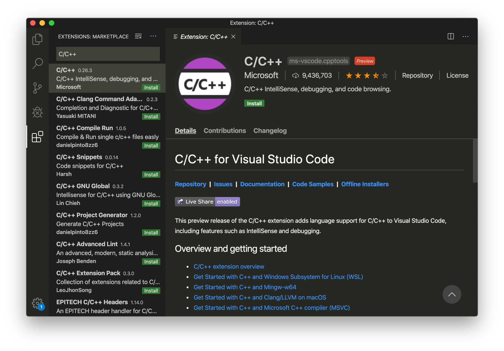

# Debugging nRF52840-MDK board with Visual Studio Code

## Introduction

[Visual Studio Code](https://code.visualstudio.com/) is a lightweight but powerful source code editor which runs on your desktop and is available for Windows, macOS and Linux. With the addition of the C/C++ extension to Visual Studio Code, you might have what is needed in such a small, cross-platform editor.

This post explains how to configure the local debug toolchain for debugging nRF52840-MDK board with Visual Studio Code.

## Hardware Requirements

- [nRF52840-MDK](https://makerdiary.com/products/nrf52840-mdk-iot-development-kit) board
- 1x USB-C cable
- A Windows/macOS/Linux PC

## Install Visual Studio Code

You need to install Visual Studio Code with the C/C++ extensions to begin.

1. Install [Visual Studio Code](https://code.visualstudio.com/).
2. Open Visual Studio Code, and click on the __Extensions__ button.
3. Search for the C/C++ plugin (by Microsoft) and click __Install__.
4. When prompted, restart the IDE.



## Install pyOCD

The latest stable version of pyOCD may be installed via [pip](https://pip.pypa.io/en/stable/index.html) as follows. __Skip__ this step if pyOCD already exists.

``` bash
pip install -U pyocd
```

## Install GNU Arm Embedded Toolchain

Download and install the [GNU ARM Embedded Toolchain](https://developer.arm.com/downloads/-/gnu-rm). Then ensure the path is added to your OS PATH environment variable:

``` bash
# in ~/.bash_profile, add the following script
export PATH="<path to install directory>/gcc-arm-none-eabi-6-2017-q2-update/bin:${PATH}"
```

Type the following in your terminal to verify if arm-none-eabi-gcc works:

``` bash
arm-none-eabi-gcc --version
```

## Configuring the debugger

The `launch.json` file is used to configure the debugger in Visual Studio Code. To configure the debugger for your project:

1. Open the project folder in Visual Studio Code.

2. Open the `.vscode/launch.json` file and add the example configurations:

    ``` bash
    {
        "version": "0.2.0",
        "configurations": [
            {
                "name": "C++ Launch",
                "type": "cppdbg",
                "request": "launch",
                "program": "${workspaceRoot}/armgcc/_build/nrf52840_xxaa.out",
                "args": [],
                "stopAtEntry": true,
                "cwd": "${workspaceRoot}",
                "environment": [],
                "externalConsole": false,
                "debugServerArgs": "",
                "serverLaunchTimeout": 20000,
                "filterStderr": true,
                "filterStdout": false,
                "serverStarted": "GDB\\ server\\ started",
                "preLaunchTask": "make",
                "setupCommands": [
                    { "text": "-target-select remote localhost:3333", "description": "connect to target", "ignoreFailures": false },
                    { "text": "-file-exec-and-symbols ${workspaceRoot}/armgcc/_build/nrf52840_xxaa.out", "description": "load file", "ignoreFailures": false},
                    { "text": "-interpreter-exec console \"monitor endian little\"", "ignoreFailures": false },
                    { "text": "-interpreter-exec console \"monitor reset\"", "ignoreFailures": false },
                    { "text": "-interpreter-exec console \"monitor halt\"", "ignoreFailures": false },
                    { "text": "-interpreter-exec console \"monitor arm semihosting enable\"", "ignoreFailures": false },
                    { "text": "-target-download", "description": "flash target", "ignoreFailures": false }
                ],
                "logging": {
                    "moduleLoad": true,
                    "trace": true,
                    "engineLogging": true,
                    "programOutput": true,
                    "exceptions": true
                },
                "linux": {
                    "MIMode": "gdb",
                    "MIDebuggerPath": "arm-none-eabi-gdb",
                    "debugServerPath": "pyocd-gdbserver"
                },
                "osx": {
                    "MIMode": "gdb",
                    "MIDebuggerPath": "arm-none-eabi-gdb",
                    "debugServerPath": "pyocd-gdbserver"
                },
                "windows": {
                    "preLaunchTask": "make.exe",
                    "MIMode": "gdb",
                    "MIDebuggerPath": "arm-none-eabi-gdb.exe",
                    "debugServerPath": "pyocd-gdbserver.exe",
                    "setupCommands": [
                        { "text": "-environment-cd ${workspaceRoot}\\armgcc\\_build" },
                        { "text": "-target-select remote localhost:3333", "description": "connect to target", "ignoreFailures": false },
                        { "text": "-file-exec-and-symbols nrf52840_xxaa.out", "description": "load file", "ignoreFailures": false},
                        { "text": "-interpreter-exec console \"monitor endian little\"", "ignoreFailures": false },
                        { "text": "-interpreter-exec console \"monitor reset\"", "ignoreFailures": false },
                        { "text": "-interpreter-exec console \"monitor halt\"", "ignoreFailures": false },
                        { "text": "-interpreter-exec console \"monitor arm semihosting enable\"", "ignoreFailures": false },
                        { "text": "-target-download", "description": "flash target", "ignoreFailures": false }
                    ]
                }
            }
        ]
    }
    ```

3. Create a make task in `.vscode/tasks.json` file:

    ``` bash
    {
        // See https://go.microsoft.com/fwlink/?LinkId=733558
        // for the documentation about the tasks.json format
        "version": "2.0.0",
        "tasks": [
            {
                "label": "make",
                "options": {
                    "cwd": "${workspaceRoot}/armgcc"
                },
                "problemMatcher": {
                    "owner": "cpp",
                    "fileLocation": ["relative", "${workspaceRoot}"],
                    "pattern": {
                        "regexp": "^(.*):(\\d+):(\\d+):\\s+(warning|error):\\s+(.*)$",
                        "file": 1,
                        "line": 2,
                        "column": 3,
                        "severity": 4,
                        "message": 5
                    }
                },
                "args": [],
                "linux": {
                    "command": "make"
                },
                "osx": {
                    "command": "make"
                },
                "windows": {
                    "command": "make.exe"
                }
            }
        ]
    }
    ```

## Debugging your project

Connect the board to your PC, click __Debug__ -> __Start Debugging__ , and debugging starts. Click on the __Debug Console__ tab to see the debug output:


Now you can explore the debugging capabilities for Variables, Breakpoints, and more.

## Example Sources

The example project files are located in GitHub: https://github.com/makerdiary/nrf52840-mdk/tree/master/examples/nrf5-sdk/blinky

## Reference

- [VS Code Launch Json Reference](https://code.visualstudio.com/docs/cpp/launch-json-reference)
- [VS Code Tasks Documentation](https://code.visualstudio.com/docs/editor/tasks)
- [nRF52840-MDK Documentation](https://wiki.makerdiary.com/nrf52840-mdk/)
