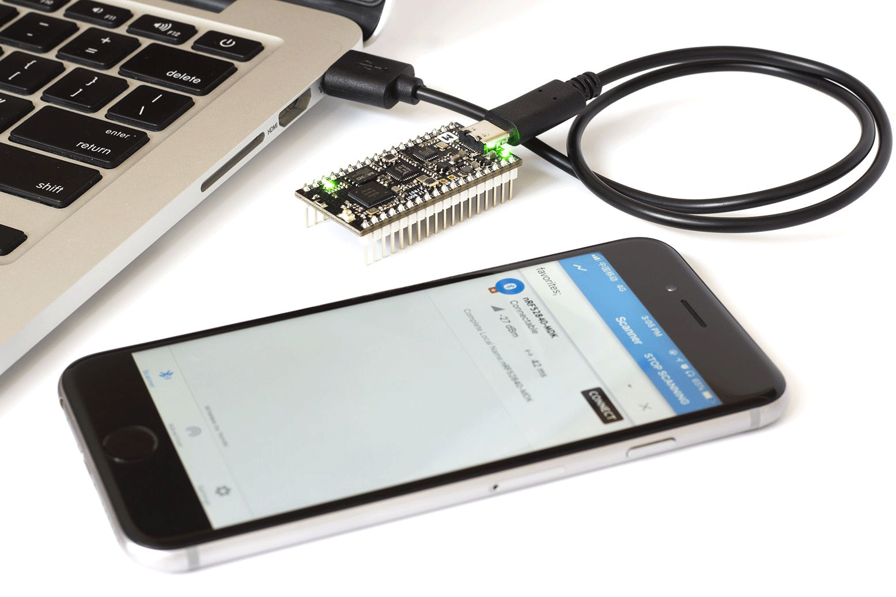
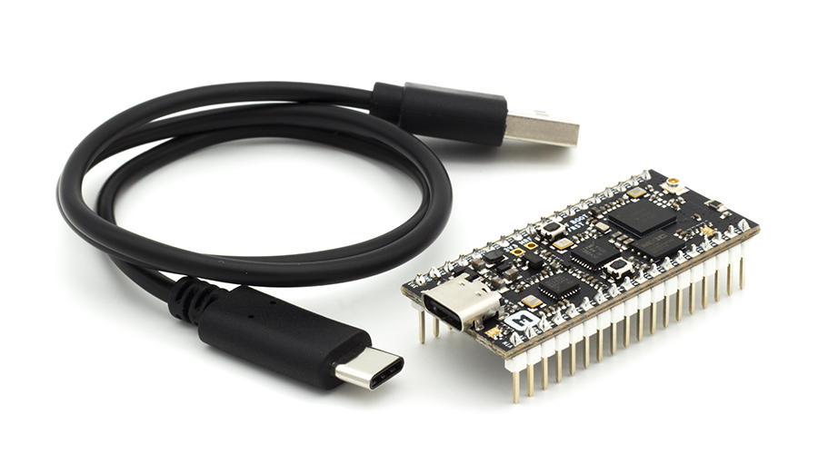
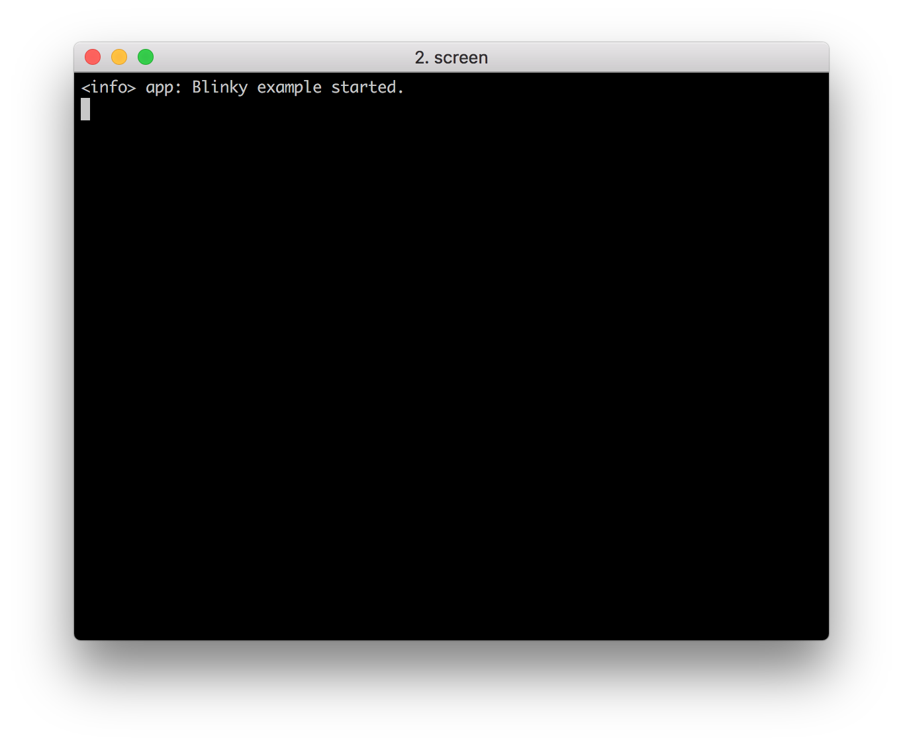
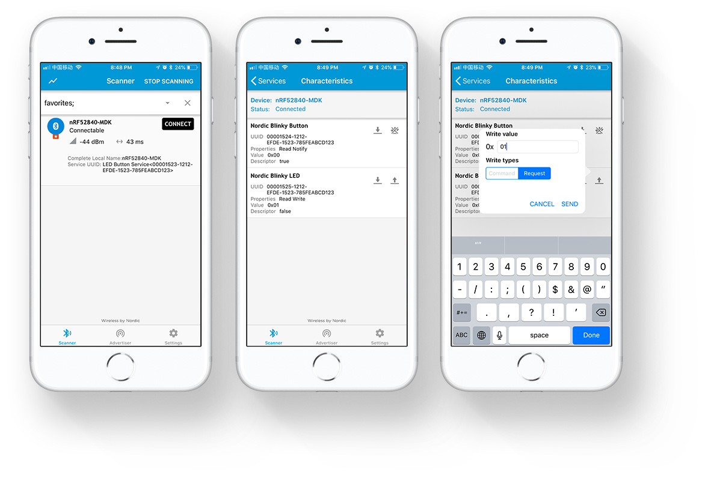
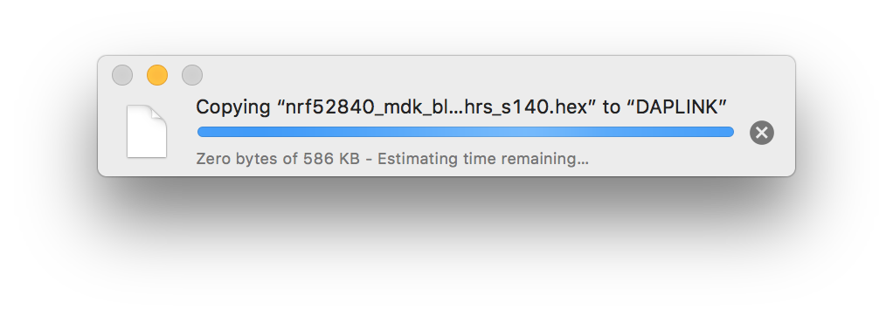
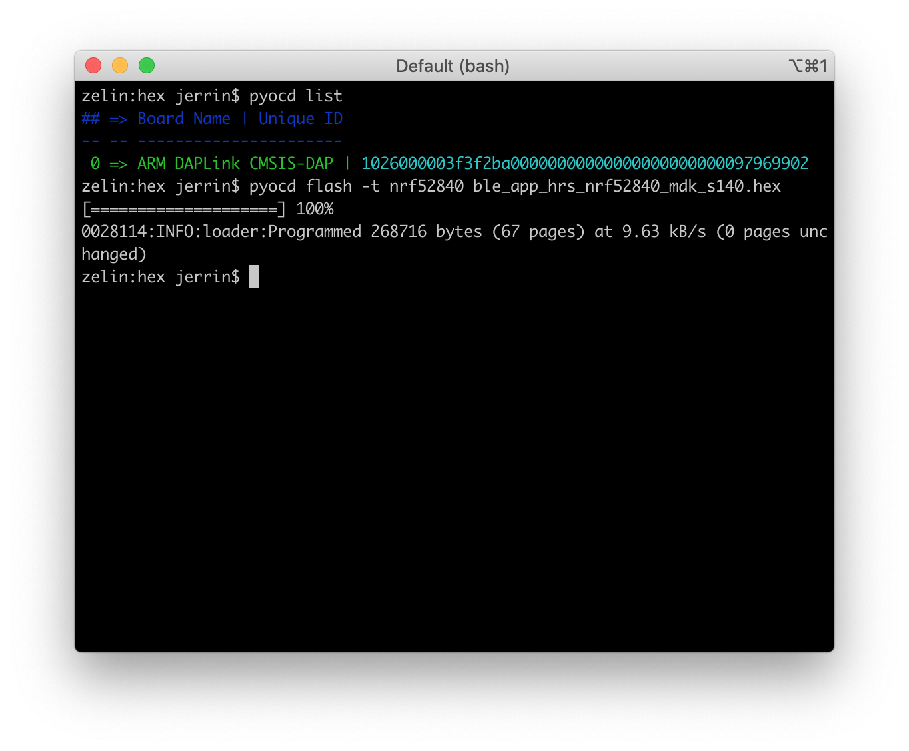

# Getting started with nRF52840-MDK

## Introduction

The [nRF52840-MDK](https://makerdiary.com/products/nrf52840-mdk-iot-development-kit) is a versatile, easy-to-use IoT hardware platform for Bluetooth 5, Bluetooth Mesh, Thread, IEEE 802.15.4, ANT and 2.4GHz proprietary applications using the nRF52840 SoC.

It comes with a fully integrated debugger (also known as [DAPLink](https://daplink.io/)) which makes it easy to program and debug application software without extra debug probe.

In this post I’ll show you how to connect and set up your nRF52840-MDK, and what to expect when you do so. This will take about 20 minutes.

## Prerequisites

In order to set up the nRF52840-MDK development kit, prepare the following:

- The [nRF52840-MDK](https://makerdiary.com/products/nrf52840-mdk-iot-development-kit) board
- A macOS/Linux/Windows PC
- An iPhone or Android phone
- 1x USB-C cable



## Set up the board

Connect the board by performing the following steps:

1. Connect the nRF52840-MDK to one of your PC’s USB host ports. This provides power to the board. Observe that two GREEN LEDs are on. One indicates that USB power is good, and another indicates that the application is advertising.
2. Open a file explorer. Confirm that the board has appeared as a removable drive named __DAPLINK__. This allows you to program the nRF52840 chip. You’ll do this under [how to program nRF52840-MDK](#how-to-program-nrf52840-mdk) below.


## Use Terminal application

Terminal applications (for example [PuTTY](https://www.chiark.greenend.org.uk/~sgtatham/putty/) or [screen](https://www.gnu.org/software/screen/manual/screen.html)) run on your host PC. They provide a window where the board prints log information.

Start a terminal application. The default setup for the USB serial port is 115200 baud, 8 bits, 1 stop bit, no parity (`115200–8-N-1`). For example on macOS, type the following command:

``` bash
screen /dev/cu.usbmodem1412 115200
```



## Use nRF Connect App

You can also test the application with the nRF Connect mobile app by performing the following steps:

- Get the nRF Connect app from App Store or Google Play.
- Connect to the device from nRF Connect (the device is advertising as __nRF52840-MDK__).
- Observe that the RGB LED stays BLUE. This indicates that the connections is established.
- bserve that the LED Button Service is shown in the connected device. It contains two characteristics: _Nordic Blinky Button_ and _Nordic Blinky LED_.
- Enable _Notify_ on the _Nordic Blinky Button_. Notifications are received when pressing or releasing the USER Button.
- Write `01` to the _Nordic Blinky LED_ and observe that RED LED is turned on.
- Write `00` to the _Nordic Blinky LED_ and observe that RED LED is turned off.



## How to program nRF52840-MDK

You have the following two options to program your board:

- [Drag-n-drop Programming](#drag-n-drop-programming)
- [Using pyOCD]()

### Drag-n-drop Programming

Drag and drop the hex file into the __DAPLINK__ removable drive. The file contains firmware which will be automatically programmed onto the nRF52840 SoC. When programming is completed, the removable drive will be re-detected by the computer. The application will run after pressing the RESET button.



### Using pyOCD

pyOCD is an open source Python package for programming and debugging Arm Cortex-M microcontrollers using multiple supported types of USB debug probes. It is fully cross-platform, with support for Linux, macOS, and Windows.

The latest stable version of pyOCD may be installed via [pip](https://pip.pypa.io/en/stable/index.html) as follows:

``` bash
pip install -U pyocd
```

For more installing options, see [pyOCD GitHub repo](https://github.com/pyocd/pyOCD#installing).

Verify if your board is detected by pyOCD by running:

``` bash
pyocd list
```

Flash the board with your new firmware by running:

``` bash
pyocd flash -t nrf52840 <path-to-your-firmware.hex>
```



## Next steps

You can clone the [makerdiary/nrf52840-mdk](https://github.com/makerdiary/nrf52840-mdk) repository or download it as a zip package and put its contents to your working directory.

``` bash
git clone https://github.com/makerdiary/nrf52840-mdk.git
```

This repository provides documents and example applications that you can run on your board to ensure that everything is set up correctly.

## Resources

- [nRF52840-MDK GitHub Repository](https://github.com/makerdiary/nrf52840-mdk)
- [nRF52840-MDK Wiki Page](https://wiki.makerdiary.com/nrf52840-mdk)
