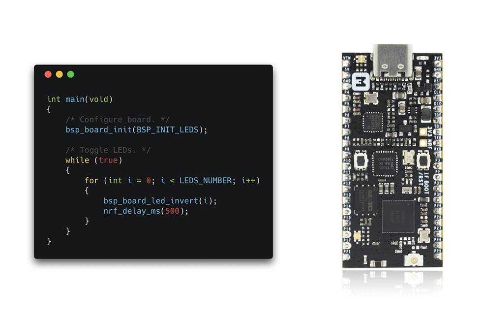
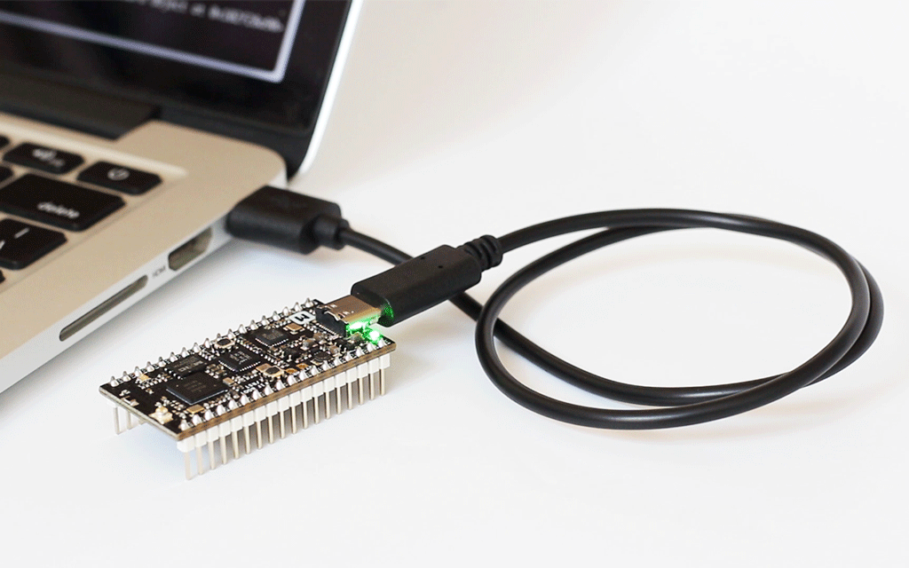
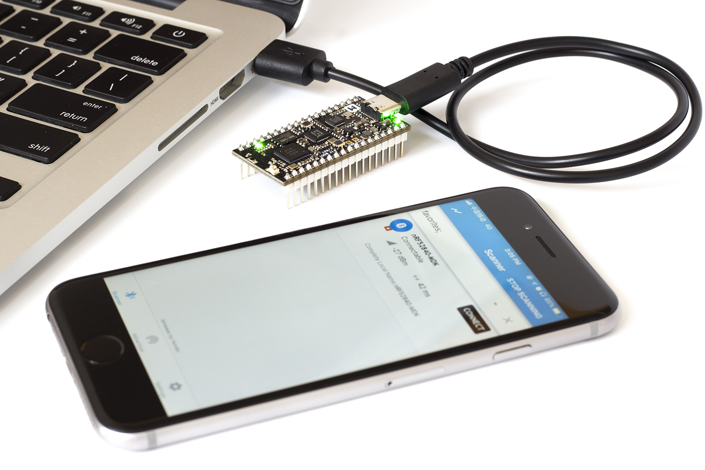

# How to set up nRF5 SDK with ARM GCC

## Introduction

The [nRF5 SDK](https://www.nordicsemi.com/Software-and-Tools/Software/nRF5-SDK/) is your first stop for building fully featured, reliable and secure applications with the nRF52 and nRF51 Series. It offers developers a wealth of varied modules and examples right across the spectrum including numerous Bluetooth Low Energy profiles, Device Firmware Upgrade (DFU), GATT serializer and driver support for all peripherals on all nRF5 Series devices. The nRF5 SDK will almost certainly have something for your needs in developing exciting yet robust wireless products.

The SDK is delivered as a plain `.zip`-archive, which makes it easy to install as well as giving you the freedom to choose the IDE and compiler of your choice.

Here we will describe how to set up the nRF5 SDK development environment on your system, build and run the example applications.

## Install GNU Arm Embedded Toolchain

The GNU Embedded Toolchain for Arm is a ready-to-use, open source suite of tools for C, C++ and Assembly programming targeting Arm Cortex-M and Cortex-R family of processors. It includes the GNU Compiler (GCC) and is available free of charge directly from Arm for embedded software development on Windows, Linux and macOS operating systems.

Download and install the [GNU ARM Embedded Toolchain](https://developer.arm.com/downloads/-/gnu-rm). The `6-2017-q2-update` version is recommended. Then ensure the path is added to your OS PATH environment variable.

``` bash
# in ~/.bash_profile, add the following script
export PATH="<path to install directory>/gcc-arm-none-eabi-6-2017-q2-update/bin:${PATH}"
```

Type the following in your terminal to verify if the path is set correctly:

``` bash
arm-none-eabi-gcc --version
```

## Install GNU make

Now with the toolchain installed we can build object files from source code, but to build projects based on makefiles, which can be seen as a recipes for the builds, we need to have GNU make installed on the system.

On Windows the easiest way to install the dependencies is to use the [MSYS2](http://www.msys2.org/). You can do so by performing the following steps:

1. Download and run the installer - "x86_64" for 64-bit, "i686" for 32-bit Windows.

2. Update the package database and core system packages with:
    ``` bash
    pacman -Syu
    ```

3. If needed, close MSYS2, run it again from Start menu. Update the rest with:
    ``` bash
    pacman -Su
    ```

4. Install make:
    ``` bash
    pacman -S make
    ```

GNU make is bundled with Xcode tools if working on macOS. On Linux it may be different ways to obtain GNU make depending on your distro, if not installed already, e.g. on Ubuntu you can get by entering this command:

``` bash
sudo apt-get install build-essential checkinstall
```

## Clone the repository

Clone the nRF52840-MDK repository from GitHub:

``` bash
git clone https://github.com/makerdiary/nrf52840-mdk
```

## Install the nRF5 SDK

Download the SDK file [nRF5_SDK_v15.2.0_9412b96](https://www.nordicsemi.com/Software-and-Tools/Software/nRF5-SDK/Download#infotabs) from https://www.nordicsemi.com . Note that the current version is `15.2.0`.

Extract the zip file to the `nrf52840-mdk/nrf_sdks` directory. This should give you the following folder structure:

``` bash
./nrf52840-mdk/
├── LICENSE
├── README.md
├── firmware
├── config
├── docs
├── examples
├── mkdocs.yml
├── nrf_sdks
│   └── nRF5_SDK_v15.2.0_9412b96
└── tools
```

To build an example application you first need to set the toolchain path in `makefile.windows` or `makefile.posix` depending on platform you are using. That is, the `.posix` should be edited if your are working on either Linux or macOS. These files are located in:

``` bash
<SDK>/components/toolchain/gcc
```

Open the file in a text editor, and make sure that the __GNU_INSTALL_ROOT__ variable is pointing to your GNU Arm Embedded Toolchain install directory.

``` bash
GNU_INSTALL_ROOT ?= $(HOME)/gcc-arm-none-eabi/gcc-arm-none-eabi-6-2017-q2-update/bin/
GNU_VERSION ?= 6.3.1
GNU_PREFIX ?= arm-none-eabi
```

## Build and run the blinky example

Now you can try to build one of the examples. Will use the blinky example here to keep it simple.

Open terminal and change directory to:

``` bash
cd ./nrf52840-mdk/examples/nrf5-sdk/blinky/armgcc/
```

Connect the nRF52840-MDK to one of your PC's USB host ports. Compile and program the example:

``` bash
make flash
```



## Run examples with SoftDevice

Before you can run more advanced examples that use Bluetooth or ANT, you must program the SoftDevice on the board.

The SoftDevice binary is located in folder `components/softdevice/<Softdevice>/hex` in the SDK, where `<Softdevice>` is the name of the SoftDevice.

The easiest way to program the SoftDevice is using the GCC makefile of an example:

1. Open a command prompt in the folder that contains the makefile of an example. The example must require a SoftDevice. For example, the `ble_app_blinky` example.

    ``` bash
    # change to the armgcc directory of 'ble_app_blinky' example
    cd ~/nrf52840-mdk/examples/nrf5-sdk/ble_app_blinky/armgcc
    ```

2. Run the following command:

    ``` bash
    # this will compile & program the application(without SoftDevice)
    make flash

    # this will program SoftDevice alone
    make flash_softdevice
    ```



## More examples

Over time, more example applications will be added to the repository. You can star or watch the [nrf52840-mdk](https://github.com/makerdiary/nrf52840-mdk) repository to stay up to date.

## Reference

- [Nordic nRF5 SDK](https://www.nordicsemi.com/Software-and-Tools/Software/nRF5-SDK)
- [Nordic Semiconductor Infocenter](https://infocenter.nordicsemi.com/index.jsp)
- [makerdiary/nrf52840-mdk repository](https://github.com/makerdiary/nrf52840-mdk)
- [nRF52840 MDK Documentation](https://wiki.makerdiary.com/nrf52840-mdk)
