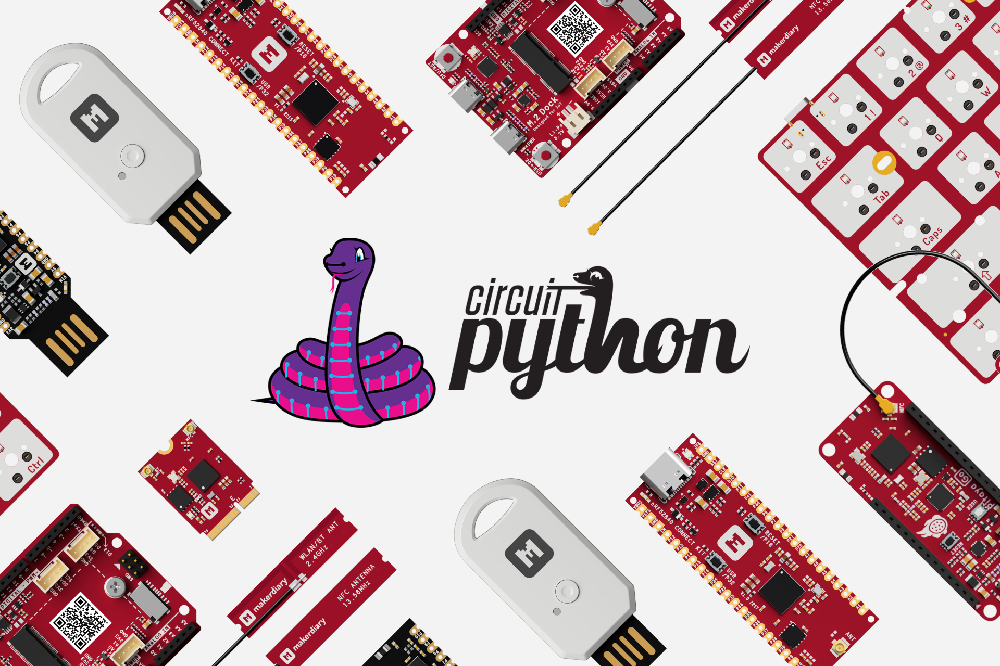

## What is CircuitPython?

CircuitPython is a programming language designed to simplify experimenting and learning to program on low-cost microcontroller boards. It makes getting started easier than ever with no upfront desktop downloads needed. Once you get your board set up, open any text editor, and get started editing code. It's that simple.

CircuitPython is an implementation of Python, which is a high-level programming language which means it's designed to be easier to read, write and maintain. It supports modules and packages which means it's easy to reuse your code for other projects. It has a built in interpreter which means there are no extra steps, like compiling, to get your code to work. And of course, it is Open Source Software which means it's free for anyone to use, modify or improve upon.

## Why CircuitPython?

CircuitPython is a fork of [MicroPython](https://micropython.org/), and offers unified Python core APIs and a growing list of 300+ device libraries and drivers that work with it. You can see [differences from MicroPython](https://github.com/adafruit/circuitpython#differences-from-micropython).

Here is some reasons to use CircuitPython:

- **You want to get up and running quickly.** Create a file, edit your code, save the file, and it runs immediately. There is no compiling, no downloading and no uploading needed.
- **You're new to programming.** CircuitPython is designed with education in mind. It's easy to start learning how to program and you get immediate feedback from the board.
- **Easily update your code.** Since your code lives on the disk drive, you can edit it whenever you like, you can also keep multiple files around for easy experimentation.
- **The serial console and REPL.** These allow for live feedback from your code and interactive programming. File storage. The internal storage for CircuitPython makes it great for data-logging, playing audio clips, and otherwise interacting with files.
- **Strong hardware support.** CircuitPython has builtin support for microcontroller hardware features like digital I/O pins, hardware buses (UART, I2C, SPI), audio I/O, and other capabilities. There are also many libraries and drivers for sensors, breakout boards and other external components.
- **It's Python!** Python is the fastest-growing programming language. It's taught in schools and universities. CircuitPython is almost-completely compatible with Python. It simply adds hardware support.

## How to get started?

To use CircuitPython, you need to choose a microcontroller board well supported by CircuitPython. There are [300+ boards](https://circuitpython.org/downloads) that can run CircuitPython.

The following boards from Makerdiary are supported by CircuitPython:

- [nRF52840 Connect Kit](https://makerdiary.com/products/nrf52840-connectkit)
- [nRF52840 MDK USB Dongle](https://makerdiary.com/products/nrf52840-mdk-usb-dongle)(we also have a [w/Case version](https://makerdiary.com/products/nrf52840-mdk-usb-dongle-w-case))
- [nRF52840 M.2 Developer Kit](https://makerdiary.com/products/nrf52840-m2-developer-kit)
- [M60 Mechanical Keyboard](https://makerdiary.com/products/m60-mechanical-keyboard-pcba)
- [Pitaya Go](https://makerdiary.com/products/pitaya-go)
- [nRF52840 MDK](https://makerdiary.com/products/nrf52840-mdk-iot-development-kit)
